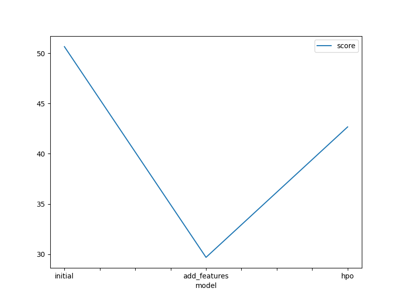
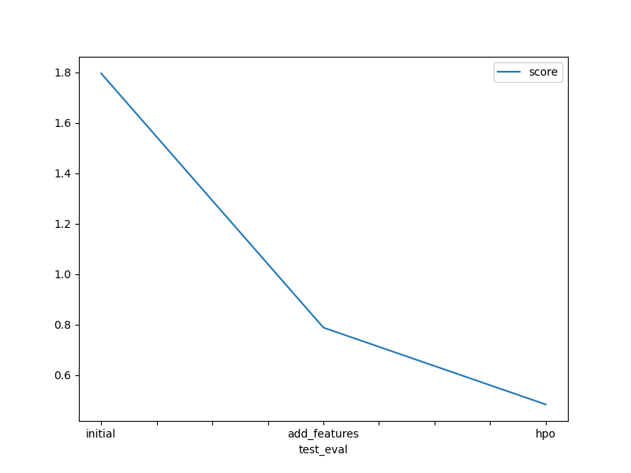

# Report: Predict Bike Sharing Demand with AutoGluon Solution
#### Devin Almonor

## Initial Training
### What did you realize when you tried to submit your predictions? What changes were needed to the output of the predictor to submit your results?
TODO: I would recieve an error because the casual and registered columns were present in the test data; however, it was removed to train the initial model.

### What was the top ranked model that performed?
TODO: WeightedEnsemble_L3

## Exploratory data analysis and feature creation
### What did the exploratory analysis find and how did you add additional features?
TODO: EDA found that there were new features that needed to be added to granularize the data set (years, months, days, and hours). Also, there were seasons and weathers that need to be accounted.
### How much better did your model preform after adding additional features and why do you think that is?
TODO: It performed better because I added more granularized features on which the model trained to give a more accurate number of its performance.

## Hyper parameter tuning
### How much better did your model preform after trying different hyper parameters?
TODO: Hyper parameter tuning improved it by preventing overfitting and underfitting of the model data.

### If you were given more time with this dataset, where do you think you would spend more time?
TODO: I would spend more time in hypertuning because of the performance increase.
### Create a table with the models you ran, the hyperparameters modified, and the kaggle score.
|model|hpo1|hpo2|hpo3|score|
"model": ["initial", "add_features", "hpo"],
    "hpo1": ['default_vals', 'default_vals', 'GBM: num_boost_round: 100'],
    "hpo2": ['default_vals', 'default_vals', 'NN: num_epochs: 50'],
    "hpo3": ['default_vals', 'default_vals', 'RF: n_estimators: 100'],
    "score": [1.79683,0.78824 , 0.48351]

### Create a line plot showing the top model score for the three (or more) training runs during the project.

TODO: Replace the image below with your own.

### Create a line plot showing the top kaggle score for the three (or more) prediction submissions during the project.

TODO: Replace the image below with your own.

## Summary
TODO: I learned a lot about testing and training datasets in the Bike Sharing project.
